<!-- Header / Banner -->

  

<!-- Short Intro -->
<h3 align="center">🚀 Tech Enthusiast | Front-End Developer </h3>

  <a href="https://www.linkedin.com/in/mohammad-affan-shofi-4108ba249">LinkedIn</a> •
  <a href="https://github.com/mas663">GitHub</a> •
  <a href="#">Portfolio Website</a>

---

### 🌟 About Me
Hi there! 👋 I'm **Affan**, an Information Systems student at **ITS Surabaya** passionate about:

- 💻 **Front-End Development** (Next.js, React, Tailwind)
- 🚀 **DevOps & CI/CD** for efficient deployment

I enjoy building projects that **solve real problems** while keeping the **code clean and scalable**.

---

### 🛠 Tech Stack & Tools

  

---

### 📊 GitHub Stats

  
  

---

### 🎮 Fun Section: Contribution Game

  

---

  

